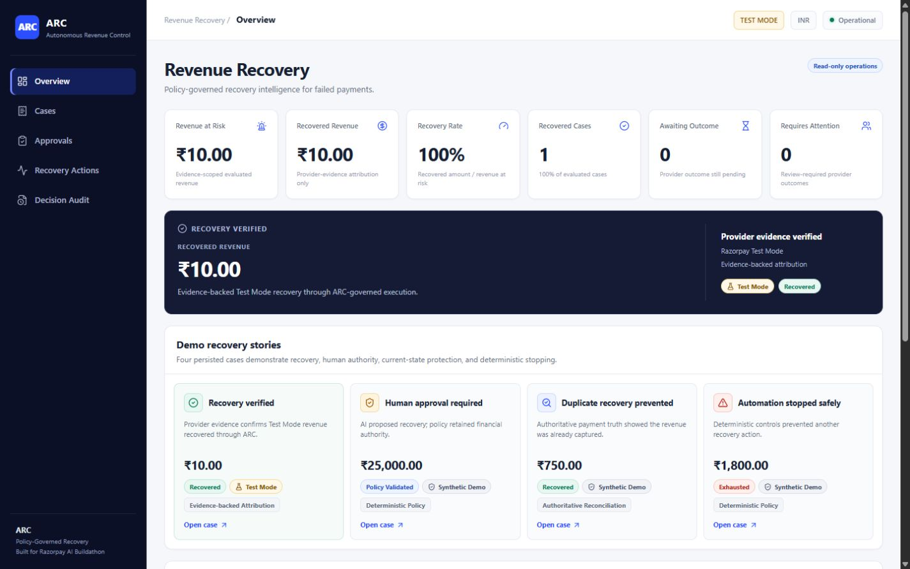
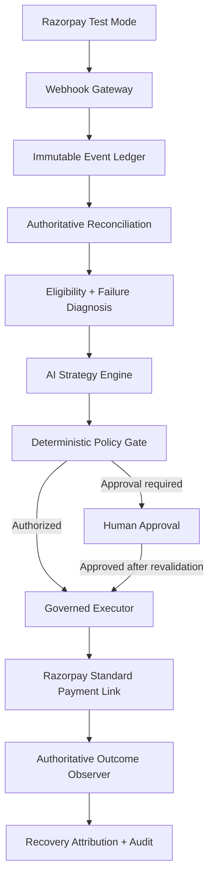
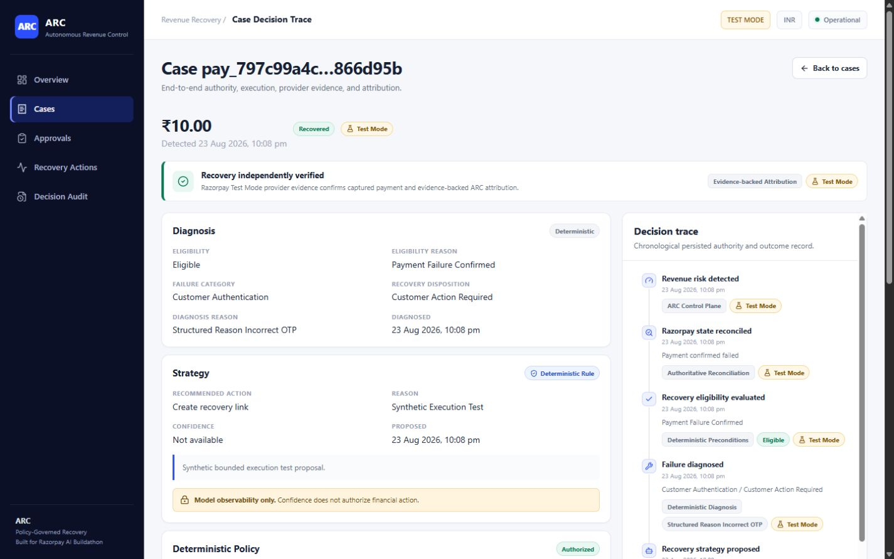
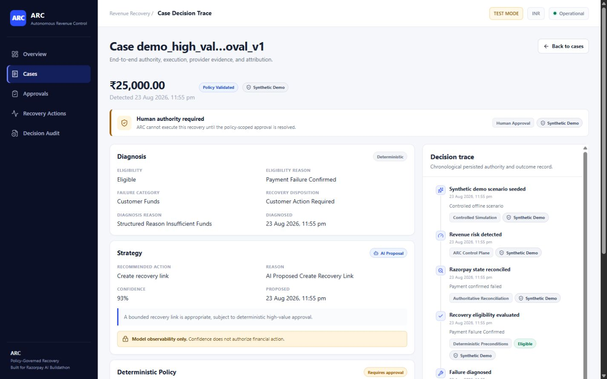
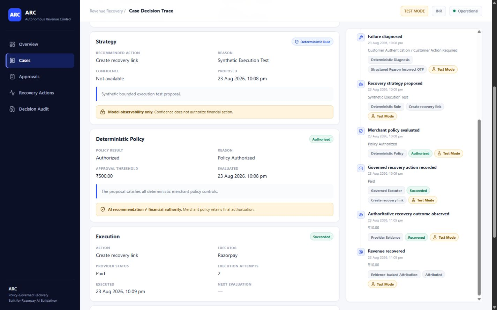

# ARC — Autonomous Revenue Control

**Policy-Governed AI Revenue Recovery for Razorpay Merchants**

Built for **Razorpay AI Buildathon — Track 03: AI Revenue Recovery**

ARC is an event-driven control plane that detects revenue at risk, reconciles current payment truth, proposes a bounded recovery strategy, enforces merchant policy, executes only authorized actions, and attributes revenue only after authoritative provider evidence confirms recovery.

> **AI proposes. Policy authorizes. The executor acts.**\
> **Provider evidence proves recovery.**

## Live demo

**Live evaluator:** [arc-revenue-control-ui.samarthpatilofc.workers.dev](https://arc-revenue-control-ui.samarthpatilofc.workers.dev)

- The public evaluator is read-only.
- Razorpay evidence is Test Mode evidence, not live money.
- Synthetic batch metrics are controlled evaluation results, not merchant revenue.
- The hosted evaluator reads sanitized persisted evidence; it does not rerun provider or model operations.

The API runs on a Render Free instance. After a period of inactivity, the
first request may take about a minute while the backend wakes. ARC shows a
`Waking demo backend…` state and retries automatically.

Live evaluator verification includes API health, database readiness, all five
evidence cases, read-only approval/recovery/audit views, and successful direct
refresh of deep SPA routes.




## The problem

A failed payment is not automatically recoverable revenue. It may already have succeeded, a platform retry may still be active, or intervention may be unsafe.

A naive recovery agent can create serious failure modes:

- acting on stale webhook state;
- retrying money already captured;
- contacting customers too often;
- bypassing merchant policy;
- taking high-value financial actions without human approval;
- claiming recovery before money was captured;
- double-counting repeated provider events.

ARC is designed around those risks. It treats revenue recovery as a control problem: establish what is true, decide what is appropriate, enforce authority, then prove the outcome.

## What ARC does

ARC closes one auditable recovery loop:

| Stage | Owner | Responsibility |
| --- | --- | --- |
| **Detect** | Deterministic | Verify and durably record accepted payment events. |
| **Reconcile** | Deterministic | Fetch authoritative provider state and prevent stale regression. |
| **Diagnose** | Deterministic | Classify bounded failure evidence and recovery eligibility. |
| **Decide** | AI or rule | Propose one action from a fixed recovery vocabulary. |
| **Authorize** | Deterministic policy / human | Enforce allowlists, limits, thresholds, approval, and stopping rules. |
| **Execute** | Governed executor | Perform only the exact authorized internal or provider action. |
| **Observe** | Deterministic | Validate authoritative Payment Link and captured-payment evidence. |
| **Measure** | Deterministic | Attribute revenue once and keep Test and Live metrics separate. |

**Authority boundary:** AI owns bounded strategy proposal. Deterministic systems own financial truth, eligibility, policy authorization, execution validation, outcome validation, and attribution. A human retains authority over policy-scoped high-value actions.

## Architecture



ARC is a modular monolith backed by PostgreSQL. The database is the concurrency and audit authority; no Redis, Celery, Kafka, or unrestricted model tool execution is involved. See [Technical Architecture](docs/ARCHITECTURE.md) for the deeper trust boundaries, state model, and data flow.

## Working proof

### Provider-backed Test Mode proof

**₹10.00 — provider-verified Test Mode recovery**

**Razorpay Test Mode — not live money.**

The persisted demonstration evidence confirms that:

- one governed Standard Payment Link was created in Razorpay Test Mode;
- the link was successfully paid in Test Mode;
- ARC fetched authoritative provider state;
- the paid amount matched the expected amount;
- captured-payment evidence was validated;
- exactly one recovery attribution was created;
- the case reached `RECOVERED`;
- outcome observation created no new Payment Link.



Creating a Payment Link is not recovery. ARC increments recovered-revenue metrics only after authoritative Payment Link identity, stable reference, amount, currency, paid amount, and captured-payment evidence all match the governed action and case.

### Demonstrated safety scenarios

| Scenario | Origin | What it demonstrates |
| --- | --- | --- |
| Provider-verified recovery | `TEST_MODE` | Closed-loop recovery and evidence-backed attribution. |
| High-value approval | `SYNTHETIC_DEMO` | An offline strategy fixture cannot bypass deterministic policy or human authority. |
| Already captured | `SYNTHETIC_DEMO` | Authoritative truth prevents unnecessary recovery. |
| Hard stop | `SYNTHETIC_DEMO` | Stopping rules terminate unsafe or exhausted automation. |
| Genuine OpenAI strategy | `SYNTHETIC_INPUT` | A real Responses API proposal is bounded by deterministic policy and stopped before execution. |

The three synthetic scenarios deterministically exercise safety branches without pretending to perform external financial actions or increasing evidence-backed recovery metrics.

## Batch evaluation

ARC presents three deliberately separate evidence layers:

1. **Provider-backed Razorpay Test Mode proof:** the existing ₹10.00 evidence-backed case.
2. **Genuine OpenAI strategy proof:** one explicit Responses API inference over synthetic input, followed by deterministic non-execution policy. Synthetic input does not mean simulated model inference.
3. **100-case synthetic batch evaluation:** a fixed-seed offline control evaluation with controlled outcomes.

| Synthetic batch metric | Result |
| --- | ---: |
| Cases evaluated | 100 |
| Revenue at risk | ₹400,020.00 |
| Eligible cases | 80 |
| Automated actions authorized | 35 |
| Human approval required | 8 |
| Already-captured protected | 11 |
| Synthetic evaluation recovered amount | ₹48,442.00 across 21 cases (12.1099% by amount) |
| Policy violations / post-capture actions / duplicate executions | 0 / 0 / 0 |

> **SYNTHETIC EVALUATION IS NOT PROVIDER-BACKED REVENUE.** It writes no operational attribution and does not affect Test Mode or Live Mode dashboard metrics.

See [ARC Batch Evaluation](docs/EVALUATION.md) for the dataset, method, safety criteria, complete results, and limitations. Reproduce the tracked aggregate with `python -m scripts.run_batch_evaluation`; the default mode makes no OpenAI or Razorpay request.

## Where AI is used — and where it is not

ARC sends the strategy engine bounded, PII-minimized case context and requires strict Structured Outputs. The model may propose exactly one action from this vocabulary:

- `NO_ACTION`
- `WAIT`
- `REQUEST_RETRY`
- `CREATE_RECOVERY_LINK`
- `REQUEST_PAYMENT_METHOD_UPDATE`
- `ESCALATE_TO_HUMAN`

The proposal is persisted and then fenced against current database state. If reconciled facts changed while the model was running, the stale result is discarded.

AI does **not**:

- decide current financial truth;
- bypass merchant policy;
- authorize high-value recovery;
- call Razorpay directly;
- determine whether revenue was recovered;
- increment recovered-revenue metrics.

**AI proposes. Policy authorizes.**



## Safety and failure model

Key safeguards include:

- webhook HMAC verification over exact raw bytes;
- database-backed webhook and action idempotency;
- authoritative provider reads before financial decisions;
- terminal-state non-regression and stale-state fencing;
- deterministic merchant policy, attempt/contact limits, and stopping rules;
- human approval at configured thresholds;
- crash-safe processing and execution leases;
- lookup-before-create after uncertain provider writes;
- exact-once attempt and contact counters;
- Payment Link identity, amount, currency, and captured-payment validation;
- provider-payment uniqueness and duplicate-attribution protection;
- explicit `TEST` / `LIVE` metric separation;
- PII-minimized strategy, action, outcome, and attribution projections.



## What broke — and how it was fixed

These are verified defects encountered during the build, not hypothetical production stories.

### Webhook processing crash safety

**Problem:** an event committed as `PROCESSING` could remain stuck after a worker crash.\
**Failure mode:** the durable event existed, but normal processing could not reclaim it.\
**Fix:** a 120-second database processing lease, transactional stale reclaim, and incremented attempt metadata.

### CI environment isolation

**Problem:** a credential-absence unit test behaved differently because CI intentionally supplied fake Razorpay credentials.\
**Failure mode:** disabling dotenv did not remove process environment variables.\
**Fix:** the test explicitly removes both Razorpay variables with pytest `monkeypatch` before constructing settings.

### Provider rate limiting during execution smoke

**Problem:** an authoritative Razorpay lookup was rate-limited before Payment Link creation.\
**Failure mode:** execution could not safely assume whether provider state was available.\
**Fix:** ARC failed safely, then retried after cooldown with the same stable action and reference; exactly one Payment Link was created.

### Historical decision trace fidelity

**Problem:** old eligibility and diagnosis timeline entries were rendered from the mutable current case projection.\
**Failure mode:** reassessment could make historical entries appear to say something they did not say at the time.\
**Fix:** the timeline now renders only bounded values persisted with each historical `CaseEvent`.

## Run the demo

### Requirements

- Python 3.12+
- PostgreSQL
- Node.js 22+

```powershell
git clone https://github.com/samarthpatilofficial/arc-revenue-control.git
Set-Location .\arc-revenue-control

Copy-Item .env.example .env
python -m venv .venv
.\.venv\Scripts\Activate.ps1
python -m pip install --upgrade pip
python -m pip install -e ".[dev]"

python -m alembic upgrade head
python -m scripts.demo_preflight
python -m uvicorn services.api.main:app --reload
```

In a second terminal:

```powershell
Set-Location .\frontend
npm ci
Copy-Item .env.example .env.local
npm run dev
```

Open `http://localhost:5173`. The operator console is read-only. For exact PostgreSQL preparation, optional deterministic scenario seeding, and the recommended walkthrough, use the [ARC Demo Runbook](docs/DEMO_RUNBOOK.md).

The repository contains no database snapshot or provider credentials. On a fresh database, preflight correctly remains `NOT READY` until the required persisted Test Mode evidence and controlled scenarios exist; it never substitutes fabricated proof.

## Repository validation

Current local validation:

| Gate | Result |
| --- | --- |
| Backend test suite | 413 passed |
| Frontend test suite | 28 passed |
| Frontend lint | Passed |
| Frontend production build | Passed |
| Deterministic demo preflight | `DEMO STATUS: READY` |

No dynamic coverage percentage is claimed.

## Technology stack

| Area | Technology |
| --- | --- |
| Frontend | React, TypeScript, Vite; Cloudflare Workers Static Assets |
| Backend | Python 3.12+, FastAPI, Pydantic v2, SQLAlchemy 2, Alembic, httpx; Docker on Render Free Web Service, Singapore |
| Database | Neon PostgreSQL 18, Singapore / TLS |
| AI | OpenAI Responses API, strict Structured Outputs |
| Source / CI | GitHub / GitHub Actions |
| Quality | pytest, Vitest, ESLint |

## Repository map

```text
arc/                    Core modular-monolith domain and application services
  reconciliation/      Authoritative provider truth and guarded state transitions
  diagnosis/           Deterministic failure classification
  intelligence/        Bounded AI context, schema, prompt, and strategy service
  policy/               Deterministic authorization and stopping rules
  approval/             Policy-scoped human approval records and revalidation
  execution/            Governed, idempotent recovery execution
  outcomes/             Authoritative observation and strict attribution
  read_models/          Display-safe operator projections
  demo/                 Controlled seeding and read-only semantic preflight
  evaluation/           Isolated synthetic scenarios, runner, and metrics
services/api/           FastAPI entry point, webhook ingress, and read API
frontend/               Read-only React operator console
migrations/             Alembic schema history
tests/                  Unit, integration, and external-contract tests
evaluation/             Aggregate synthetic evaluation artifacts
docs/                   Product, architecture, and demo guidance
```

## Deployment

The live read-only evaluator uses Cloudflare Workers Static Assets for the
React/Vite SPA, a Render Free Docker Web Service in Singapore for FastAPI, and
Neon PostgreSQL 18 in Singapore with TLS. The public frontend is
[arc-revenue-control-ui.samarthpatilofc.workers.dev](https://arc-revenue-control-ui.samarthpatilofc.workers.dev),
and its API is [arc-revenue-control.onrender.com](https://arc-revenue-control.onrender.com).
See [ARC Deployment](docs/DEPLOYMENT.md) for the safety boundary, reproducible
static-asset deployment, bounded cold-start handling, and sanitized
evidence-replica workflow.

## Local development details

### PostgreSQL configuration

Native PostgreSQL and the optional Compose service are both supported. Create separate development and test databases, then configure the private `.env`:

```dotenv
DATABASE_URL=postgresql+psycopg://<username>:<password>@localhost:5432/<database>
TEST_DATABASE_URL=postgresql+psycopg://<username>:<password>@localhost:5432/<database>_test
```

The test database name must end in `_test`; destructive test setup refuses any other target. Never commit `.env`. If Docker is available, PostgreSQL can instead be started with `docker compose up -d postgres`.

### Read API

```text
GET /health
GET /api/v1/dashboard/summary?provider_mode=TEST&currency=INR
GET /api/v1/evaluation/summary
GET /api/v1/cases
GET /api/v1/cases/{case_reference}
GET /api/v1/cases/{case_reference}/timeline
GET /api/v1/approvals
GET /api/v1/recovery-actions
```

Read responses omit customer, merchant, payment, subscription, and provider-payment identifiers; raw provider/webhook data; credentials; fingerprints; idempotency keys; and Payment Link URLs. CORS is deny-by-default and must be configured with explicit origins. For the standard Vite reviewer setup, allow both `http://localhost:5173` and `http://127.0.0.1:5173`; wildcard origins remain rejected.

### Webhook and governed recovery development

`POST /webhooks/razorpay` verifies `X-Razorpay-Signature` over the exact raw request body and requires `x-razorpay-event-id`, protected by database uniqueness. Valid unknown event types are retained without unsafe processing.

Supported webhook families cover payment failure/capture, subscription pending/halted, and Payment Link outcome signals. Webhooks are triggers rather than financial truth: supported entities are reconciled with authoritative Razorpay reads before decisions or attribution.

Private Razorpay and OpenAI credentials are optional for tests and local read-only demonstration. They belong only in `.env`; `.env.example` contains non-secret placeholders.

### Controlled demo scenarios

Synthetic seeding is disabled by default and creates only three reserved, idempotent offline scenarios:

```powershell
$env:ARC_DEMO_MODE = "true"
python -m scripts.seed_demo
Remove-Item Env:ARC_DEMO_MODE
```

The seeder makes no Razorpay/OpenAI calls and creates no Payment Link. `SYNTHETIC_DEMO` cases never increase evidence-backed recovered-revenue metrics.

### Genuine OpenAI evidence case

With a private `OPENAI_API_KEY` configured, an operator may explicitly run:

```powershell
python -m scripts.create_openai_evidence_case
```

This idempotent workflow uses fabricated input, the production `OpenAIResponsesClient`, the bounded strategy schema, and deterministic merchant policy. It makes no Razorpay request, creates no recovery action, and creates no recovery attribution. It is never run automatically or in CI.

### Quality commands

```powershell
python -m pytest
python -m compileall arc services scripts evaluation
python -m pip check
python -m scripts.run_batch_evaluation

Set-Location .\frontend
npm run lint
npm test -- --run
npm run build
```

## Current scope and limitations

- The provider-backed proof is Razorpay Test Mode, not live merchant money.
- The operator console is read-only and has no approval or execution mutation controls.
- There is no production operator identity, authentication, or authorization system.
- There is no automatic polling scheduler.
- `REQUEST_RETRY` and `REQUEST_PAYMENT_METHOD_UPDATE` have no external executor.
- Partial-payment attribution is not supported.
- ARC does not capture or refund payments.
- ARC sends no customer communications.

## Razorpay AI Buildathon

**Track:** 03 — AI Revenue Recovery\
**Project:** ARC — Autonomous Revenue Control

**Core thesis:** AI can help choose a recovery strategy, but financial authority and recovered revenue must remain evidence-governed.

Built for Razorpay AI Buildathon. ARC does not claim Razorpay endorsement or official integration status.
